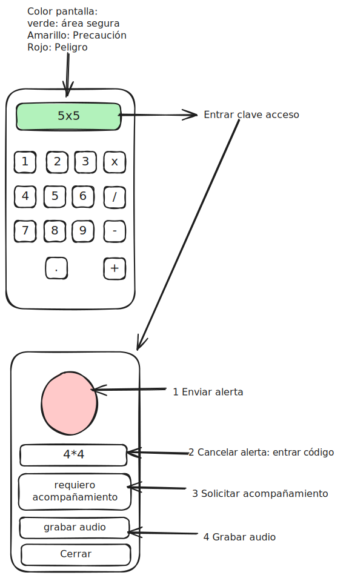
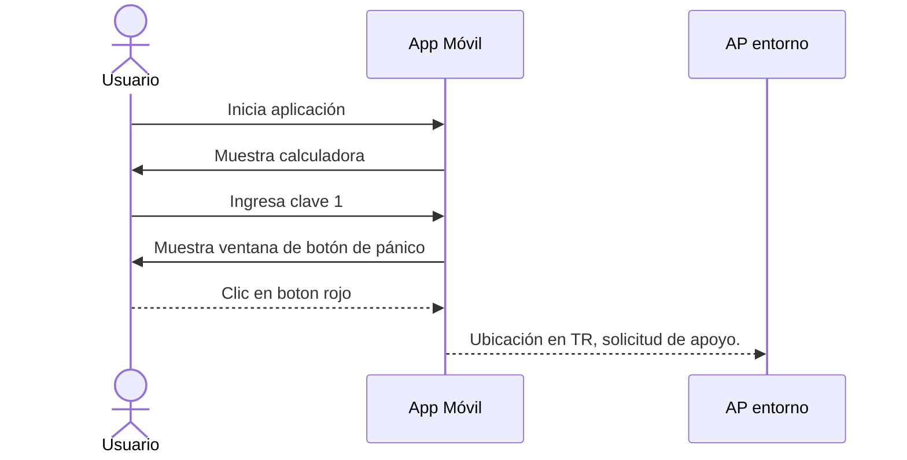
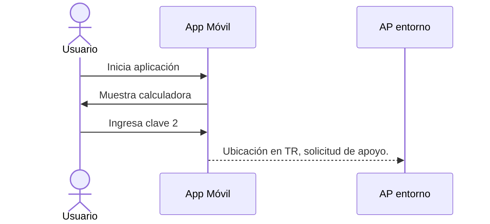
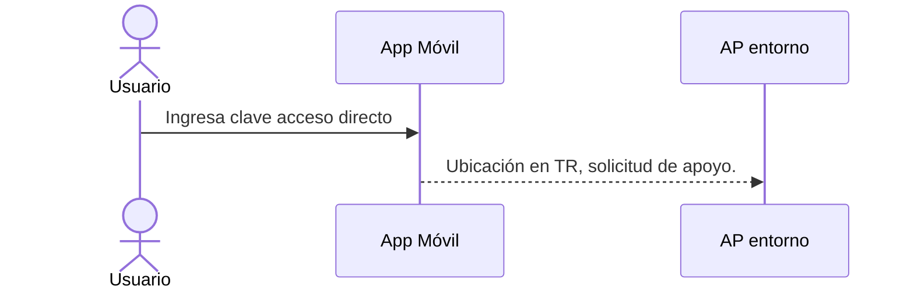

# interfaz

## Iniciando app

Clave 1
Mostrando ventana de botón de pánico

```mermaid
sequenceDiagram
    actor Usuario
    participant App as App Móvil
    participant Entorno as AP entorno

    Usuario->>App: Inicia aplicación
    App->>Usuario: Muestra calculadora
    Usuario->>App: Ingresa clave 1
    App->>Usuario: Muestra ventana de botón de pánico
    Usuario-->>App: Clic en boton rojo
    App-->>Entorno: Ubicación en TR, solicitud de apoyo.
```

Clave 2

```mermaid
sequenceDiagram
    actor Usuario
    participant App as App Móvil
    participant Entorno as AP entorno

    Usuario->>App: Inicia aplicación
    App->>Usuario: Muestra calculadora
    Usuario->>App: Ingresa clave 2
    App-->>Entorno: Ubicación en TR, solicitud de apoyo.
```

Clave acceso directo

```mermaid
sequenceDiagram
    actor Usuario
    participant App as App Móvil
    participant Entorno as AP entorno

    Usuario->>App: Ingresa clave acceso directo
    App-->>Entorno: Ubicación en TR, solicitud de apoyo.
```
